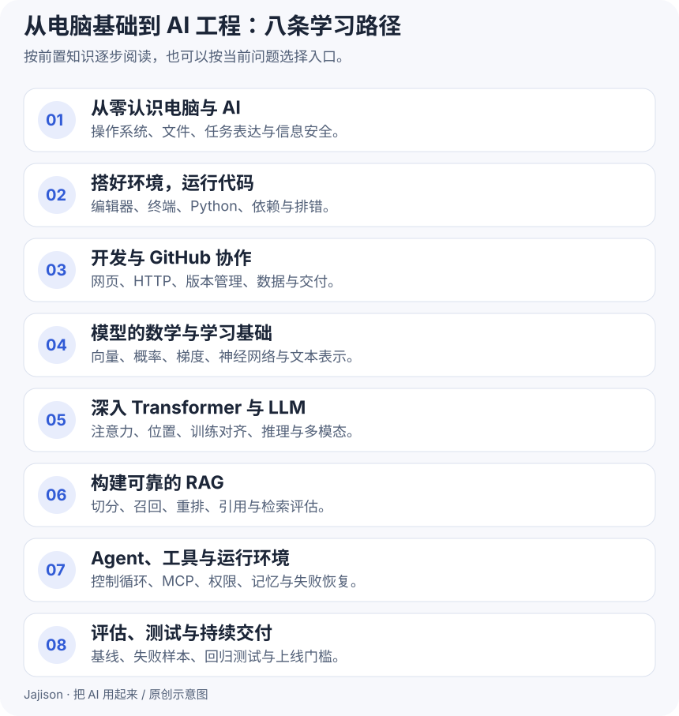

# 不懂代码，也能开始把 AI 用起来

从一份清楚的任务说明开始，让 AI 帮你整理信息、处理重复工作、做出自己的小工具。遇到需要的技术，再学一点：终端、脚本、网页，以及让 AI 连续做事的 Agent。

**先做成一件小事，再理解它为什么能做成。**

[开始第一课 →](learn/01-first-result.md) · [按目标选路线](start.md) · [直接做项目](projects/01-weekly-report.md)

## 你想先解决什么问题

| 现在的目标 | 从这里开始 | 做完带走什么 |
| --- | --- | --- |
| 写周报、整理会议记录、读资料 | [让 AI 交出一份可用成果](learn/01-first-result.md) | 一份能核对来源的行动清单 |
| 每周重复整理同类数据 | [让 Python 帮你汇总工作记录](projects/02-work-tool.md) | 一个可重复运行的本地工具 |
| 做一个自己的小网页 | [把需求变成最小产品](learn/11-build-with-ai.md) | 一个能新增、勾选、导出待办的网页 |
| 让 AI 先查资料，再回答 | [搭一条资料问答流程](projects/03-document-assistant.md) | 带出处、知道何时说“不知道”的问答方法 |

## 五个阶段，只学够用的部分

**01 · 先用起来**  
[交代任务](learn/01-first-result.md) → [给资料、查事实](learn/02-context-and-checks.md) → [认识文件](learn/03-files-and-formats.md) → [准备工作台](learn/04-workspace.md)

**02 · 让电脑重复做事**  
[终端与 Linux](learn/05-terminal-and-linux.md) → [一个 Shell 脚本](learn/06-shell.md) → [一点 Python](learn/07-python.md) → [读懂报错](learn/08-debugging.md)

**03 · 和 AI 一起开发**  
[网页与 API](learn/09-web-and-api.md) → [Git 与 GitHub](learn/10-git-and-github.md) → [做出小网页](learn/11-build-with-ai.md) → [测试与发布](learn/12-test-and-publish.md)

**04 · 理解模型，做更好的选择**  
[NLP 与文本表示](learn/13-nlp.md) → [Transformer](learn/14-transformer.md) → [LLM 的能力与局限](learn/15-llm.md) → [RAG](learn/16-rag.md)

**05 · 让 AI 连续、可靠地做事**  
[Workflow 与 Agent](learn/17-agent.md) → [工具、MCP 与 Skill](learn/18-tools-and-mcp.md) → [Harness](learn/19-harness.md) → [用小样本评估效果](learn/20-evaluation.md)

## 遇到问题时

[术语白话表](glossary.md)回答“这是什么”，[任务卡](prompt-cards.md)帮助“我该怎么交代”，[排错入口](troubleshooting.md)帮助“卡在这里怎么办”。

教程里的公司、人物、工作记录和制度均为虚构练习素材。你可以先用这些素材完整做一遍，再换成适合处理的真实任务。

