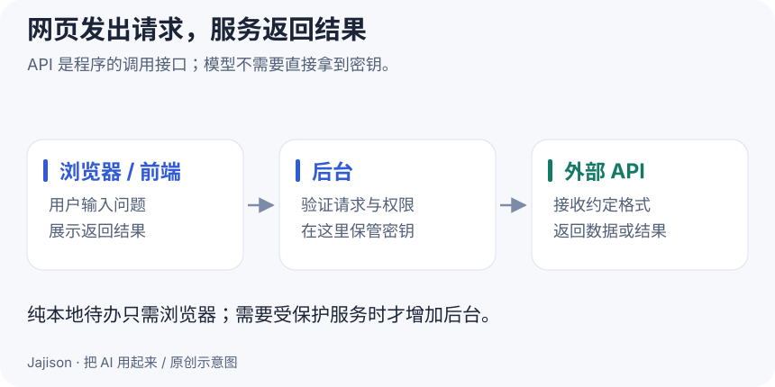

# 网页与 API：你点一下，电脑之间发生了什么

**这一课做成什么**：能判断需求只需网页，还是需要后台服务。

一个待办网页，可以只在浏览器里工作；一个调用在线 AI 的网页，通常还要向服务发送请求。外观看起来差不多，数据走的路却不同。

## 页面先分三块

- **HTML**：结构，比如标题、输入框、按钮。
- **CSS**：样式，比如颜色、间距、字体。
- **JavaScript**：交互，比如点按钮后新增待办。

三者合起来就能做一个简单网页。它们不等于需要一台自己管理的服务器。

## 前端、后端和 API

**前端**是用户看见并操作的页面；**后端**是在服务器上处理请求的程序；**API**是程序之间约定好的接口。像“提交一段文字，返回摘要”这样的能力，可以通过 API 提供。

一次请求通常有地址、方法、参数或正文；响应包含状态码和结果。200 通常表示请求成功处理，401 常与身份认证有关，429 常与限流或额度有关，实际含义以服务说明和响应正文为准。

这是一个示意响应，不代表真实服务：

~~~json
{"task": "确认场地", "status": "pending"}
~~~

收到 200 不意味着内容一定正确。服务可以顺利返回一个计算错误或缺少关键信息的结果，仍需业务验收。

## 把请求拆开看

HTTP 请求中的方法表达操作意图：GET 通常读取，POST 通常提交供服务处理的数据；具体能力由接口约定。路径指向资源，查询参数常用于筛选；请求头描述格式与认证，正文携带结构化输入。JSON 只是常见内容格式，HTTP 也能传图片、文本或文件。

浏览器开发者工具的 Network/网络面板可以看到请求地址、状态、请求头和响应。Windows 常用 F12 或 Ctrl+Shift+I，Mac 常用 Option+Command+I，具体看浏览器菜单。先打开网络面板再刷新自己的练习页面，找到 todo.html，查看它从哪一个地址加载。不要把带 Cookie 或 Authorization 的请求截图公开。

## 真正运行一次本地 API

下载并解压 [练习包](../downloads/ai-workshop.zip)。在根目录的第一个终端启动：

~~~sh
python3 api_lab.py --port 8001
~~~

Windows 把 python3 换成 py -3。终端显示 READY 与本地地址后保持运行。在浏览器打开 [健康检查](http://127.0.0.1:8001/api/health)，应看到服务状态。再打开第二个终端，进入同一个练习目录，运行：

~~~sh
python3 api_client.py --port 8001 --status done
python3 api_client.py --port 8001 --input input/records.json
~~~

第一条发出 GET /api/tasks?status=done，筛出三条已完成记录、共 90 分钟；第二条读取四条教学记录，POST 到 /api/summarize，返回总数 4、已完成 3、待办 1、总耗时 120、已完成耗时 90。用 [Python 课](07-python.md)的本地计算结果核对，它们应该一致。

这是真实 HTTP 通信，只在本机发生，没有调用 AI，也不保存提交数据。完成后在服务终端按 Control+C 停止，再运行客户端，观察“连接失败”与“数据内容错误”的区别。端口被占用时换成 8002，并同时修改服务和客户端参数。

本地演示服务不等于生产后端：公开服务还需要认证、输入限额、日志、并发控制与部署维护，继续读 [网络与密钥](../guides/network-and-security.md)、[数据与 SQL](../guides/data-and-sql.md)和 [测试与交付](../guides/testing-and-delivery.md)。

## 本地地址是什么

localhost 和 127.0.0.1 通常指当前电脑。地址后的 :8000 是端口，用来区分这台电脑上的不同服务。http://127.0.0.1:8000 并不是自动对外发布的网址。

本地预览要有程序持续运行。停止终端里的服务后，刷新页面可能无法访问；浏览器里此前已经加载的内容可能仍能交互。

## 哪些需求需要后台

| 需求 | 最小方案 |
| --- | --- |
| 我的电脑上记待办 | 静态网页 + 浏览器本地保存 |
| 多台设备同步待办 | 可同步的存储服务与身份机制 |
| 安全调用需要密钥的 AI API | 后台代理或平台提供的受保护服务 |
| 给同事看课程文章 | 静态博客即可 |

前端代码可以被访问者查看。API 密钥不能放进公开网页的 JavaScript；写在前端配置文件里，也不会因此变成秘密。聊天产品订阅和开发者 API 的授权、计费也可能分开，不能默认通用。

## 动手做

把“个人待办、无需登录、只在本机保存”交给 AI，让它先画出数据流，列出哪些数据会离开电脑。看方案是否无故加入数据库和复杂账号。

**完成标准**：你能解释自己的工具是否联网、数据保存在哪里、密钥应该由谁保管。

自测：网页能访问，代表另一台电脑能看到我的待办吗？

不代表。页面可以公开，但 localStorage 保存的数据属于当前浏览器和站点来源。跨设备同步需要额外设计。

参考：[MDN：你的第一个网站](https://developer.mozilla.org/en-US/docs/Learn_web_development/Getting_started/Your_first_website)。

[上一课](08-debugging.md) · [下一课：Git 与 GitHub →](10-git-and-github.md)
