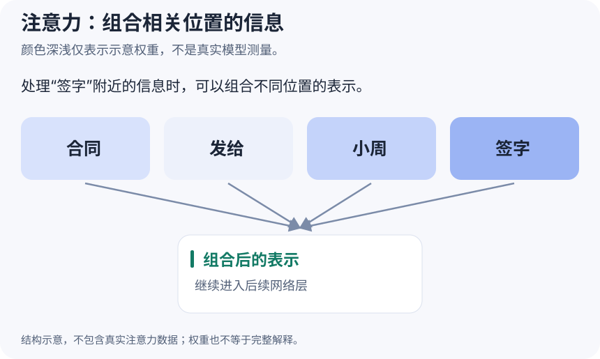

# Transformer：从输入向量到下一 token

**这一课做成什么**：沿着输入、表示、注意力、前馈网络和输出逐步追踪数据，并解释模型为什么能关联上下文，又为什么不保证事实正确。

## 先建立整张地图

Transformer 是 2017 年《Attention Is All You Need》提出的序列建模架构。注意力是核心组件，但 **Transformer 不只有注意力**：还包括输入表示、位置信息、前馈网络、残差连接、归一化和输出层。

常见文本生成模型的简化链路是：

~~~text
文字 → tokenizer → token ID → embedding
     → 多层 Transformer 块 → 最终归一化 → 词表 logits
     → 解码策略选下一 token → 追加到上下文 → 继续
~~~

本课先讲计算结构。向量、矩阵、softmax 不熟悉时，先看 [数学起点](../guides/math-for-ai.md)。数学不是装饰：维度能直接帮助你发现公式或实现错误。

## 三种架构，别混成一种

| 架构 | 每个位置能看什么 | 代表与常见用途 |
| --- | --- | --- |
| Encoder-only | 输入序列双向上下文 | BERT 类；分类、抽取、表示 |
| Decoder-only | 因果可见范围内的前文与当前位置 | GPT、Llama 类；自回归生成 |
| Encoder–Decoder | 编码器双向；解码器因果并读取编码器输出 | 原始 Transformer、T5；序列到序列 |

现代 decoder-only 并不是把原始解码器原样复制：通常没有读取独立编码器的 cross-attention 子层。具体归一化、位置机制和 FFN 也可能不同，应读模型配置而不是凭名称推断。

## Q、K、V 从哪里来

先忽略 batch 与多头。输入 $X\in\mathbb R^{T\times d}$，T 是 token 数，d 是隐藏维度。通过三个可训练投影得到：

$$
Q=XW_Q,\qquad K=XW_K,\qquad V=XW_V
$$

$Q$ 和 $K$ 形状为 $T\times d_k$，$V$ 为 $T\times d_v$。Query 参与提出匹配，Key 参与被匹配，Value 是实际加权组合的内容。它们是从当前层数值表示算出的向量，不是手工写好的“关键词标签”。

自注意力的 Q/K/V 来自同一序列；交叉注意力的 Query 来自一个序列，Key/Value 来自另一个序列，例如解码器读取编码器输出。

## 一条公式拆成四步

$$
\operatorname{Attention}(Q,K,V)=
\operatorname{softmax}\left(\frac{QK^T}{\sqrt{d_k}}+M\right)V
$$

1. **打分**：$QK^T$ 计算每个查询位置和每个键位置的点积，得到 $T\times T$ 的表。
2. **缩放**：除以单头维度的平方根 $\sqrt{d_k}$，不是整个模型维度的平方根。
3. **遮罩和归一化**：把不可看的位置用 mask M 屏蔽，再沿键位置这一维做 softmax。
4. **取内容**：概率权重乘 V，得到每个查询位置新的 $d_v$ 维表示。

为什么缩放？在分量近似独立、均值 0、方差 1 的简化假设下，点积方差随 $d_k$ 增长；过大的分数可能使 softmax 饱和、梯度不利于学习。缩放帮助控制量级，但“不缩放就必然不收敛”并不是不带条件的定理。

## 可以手算的例子

令一个查询 $q=[1,0]$，三个键依次为 $[1,0]$、$[0,1]$、$[1,1]$。单头维度 $d_k=2$，点积为 $[1,0,1]$，缩放后约为 $[0.7071,0,0.7071]$。

做 softmax，权重约为 $[0.4011,0.1978,0.4011]$。若三个值向量是 $[1,0]$、$[0,2]$、$[3,1]$，输出约为 $[1.6044,0.7967]$。

这个输出不是一句文字，而是数值表示；后面的层还要继续处理。实验中的向量由我们指定，**不是从真实模型提取的注意力，也不代表真实词语关系**。在 [原理实验室](../labs.md) 可以改变查询位置和因果遮罩，观察权重。

## 因果掩码为什么重要

自回归训练把整条已知序列一起输入，但预测某个位置的后续 token 时，不允许偷看未来。常见 mask 在允许位置为 0，未来位置为负无穷；softmax 后未来权重为 0。

训练可以在单层内并行计算所有位置，因为正确输入序列已知；但每层仍依赖前一层。生成时下一个 token 尚未决定，因此通常按步生成。不能把“Transformer 能并行”理解成“能无条件一次生成所有 token”。

推理的 prefill 阶段也可能一次处理完整提示，仍需正确的因果规则。单步增量解码没有未来 token，但批量解码、缓存偏移、padding 和打包序列仍需正确处理可见范围，不宜笼统写“推理不需要 mask”。

## 多头、FFN、残差分别做什么

多头让不同投影子空间独立计算注意力，再拼接并输出投影。固定模型维度 d 时，增加头数通常会减小单头维度；不是无条件增加参数。头并非固定分工的“语法专家”“事实专家”。

FFN 对每个位置做相同的非线性变换，常见为升维、激活、降维。注意力负责位置之间的信息交换，FFN 提供位置内的非线性变换能力。原始 FFN 的中间宽度 4d 是经验设计，不是所有模型必须遵守的数学常数。

残差把输入加回子层输出，为深层优化提供更直接的信息与梯度路径。归一化控制特征量级。一个现代 Pre-Norm 块可以概括为：

$$
H=X+\operatorname{Attention}(\operatorname{Norm}(X))
$$

$$
Y=H+\operatorname{FFN}(\operatorname{Norm}(H))
$$

这里省略了投影、位置处理和 dropout 等细节。原始 Transformer 使用 Post-Norm，很多现代模型用 Pre-Norm 与 RMSNorm；不要把上式冒称为所有模型统一结构。

## 位置与计算成本

单纯内容匹配不充分表达顺序，因此需要位置信号。原始架构向输入加入正弦位置编码；RoPE 则旋转 Q/K 的二维分量，让点积体现相对位置关系。详见 [注意力与位置](../guides/attention-and-position.md)。

标准密集注意力的打分与加权计算随长度约为 $O(T^2d)$。投影与 FFN 还有 $O(Td^2)$ 等开销，不能把前者当成整个模型全部成本。FlashAttention 减少显存读写与大中间矩阵存储，并未把密集注意力的数学关系改成线性复杂度。

## 动手做与边界

在实验室关掉与打开因果掩码，检查第一行是否只能看自己。再用上面的数值手算一遍，确认每行权重和约为 1。最后解释：为什么某个位置权重高，也不能证明模型的结论被现实证据支持？

**完成标准**：能画出一个 Transformer 块，说明 Q/K 用于匹配、V 用于组合，指出 mask、位置、FFN 和归一化的作用，并区分训练并行与生成逐步。

自测：注意力权重能作为模型决策的完整解释吗？

不能。还有 V 的内容、多个头、多层变换、残差和 FFN 等共同影响输出。即使图来自真实模型，也不能仅凭高权重推断因果贡献，更不能替代事实核查。

参考：[Attention Is All You Need](https://arxiv.org/abs/1706.03762)、[The Annotated Transformer](https://nlp.seas.harvard.edu/annotated-transformer/)、[PyTorch 缩放点积注意力](https://pytorch.org/docs/stable/generated/torch.nn.functional.scaled_dot_product_attention.html)。

[上一课](13-nlp.md) · [下一课：LLM](15-llm.md) · [深入注意力与位置](../guides/attention-and-position.md)
