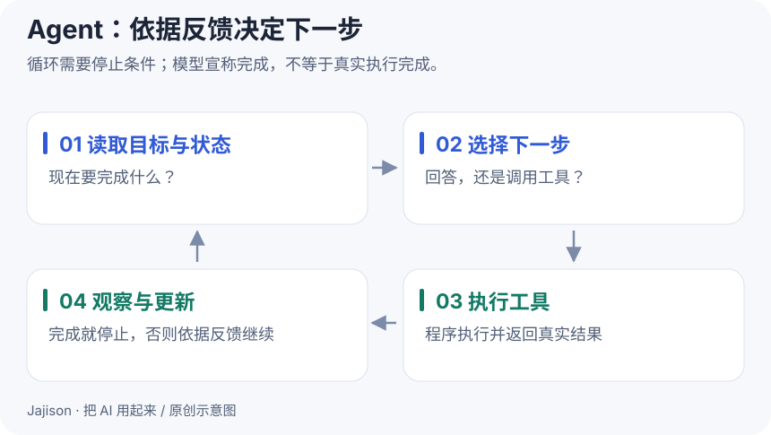

# Workflow 与 Agent：谁决定下一步

**这一课做成什么**：为固定汇总与动态排错选择合适结构，运行一个工具循环，辨别决策、执行和完成证据。

**Workflow（工作流）**按照预先定义的路径组织步骤，其中可以包含模型；本教程用 **Agent** 指模型根据目标与环境反馈动态决定行动的系统。不同产品对名称有不同约定，读结构比读名字更有用。[架构区分来源](https://www.anthropic.com/engineering/building-effective-agents)

## 同一个报告任务，三种结构

~~~text
脚本：读取 JSON → 校验 → 统计 → 保存
工作流：读取 → 统计 → 模型改写 → 程序核对 → 人工交付
Agent：观察当前资料 → 决定查什么/用什么工具
      → 执行 → 根据返回再决定 → 验收
~~~

前两条路径大体已知。对“把同一格式数据按同一口径求和”，脚本能直接完成，不需要引入模型产生计算不确定性。

对“查清网页为什么启动失败”，下一步取决于观察：端口占用要检查进程，模块缺失要核对解释器，语法错误要定位文件。模型动态选择有价值，但执行仍需要工具，成功仍需要实际重跑。

## 四个概念，把 Agent 拆开看

**策略 policy**决定下一步；**行动 action**是提出的工具调用或回答；**观察 observation**是环境真实返回；**状态 state**是当前已知事实与任务进度。

~~~text
读取目标与状态
  → 提出行动
  → 程序校验参数、权限与预算
  → 执行工具，取得真实观察
  → 更新状态
  → 继续、请求缺失信息、停止或进入验收
~~~

模型写“文件已经存在”是一个陈述；工具返回实际文件内容才是观察证据。模型生成 JSON 工具请求，也不等于该工具已执行。日志应记录调用与结果，不必依赖模型写出冗长的内部思考来证明可靠。

例如任务“找到活动截止时间”，第一次完整问句检索无结果，下一次选择更具体关键词，这是一种依据反馈改变行动的结构。若这个选择由固定代码规定，它是控制循环或工作流；若由模型在允许工具中选择，才符合本课的模型驱动 Agent 定义。

## 运行真实循环，先看执行层

在 ai-workshop 根目录运行，Windows 把 python3 换成 py -3：

~~~sh
python3 controlled_loop.py "什么时候停止报名？"
~~~

配套策略先原样检索，再按预设关键词规则改写。预期有两次实际 search_notes 调用；返回 JSON 中 calls_used 为 2，stop_reason 为 evidence_found，并列出来源片段。

这段代码**没有 LLM**，是用来观察工具与控制逻辑的确定性实验。不要因为它循环两轮就报告“自主 Agent 已搭好”。接入模型时，只替换决定行动的策略部分，保留参数校验、真实执行、预算和日志。

再限制一轮：

~~~sh
python3 controlled_loop.py "什么时候停止报名？" --max-calls 1
~~~

预期停止原因为 budget_exhausted。它没有找到证据，但正确遵守了预算。系统可以同时“没有完成业务目标”和“正确执行停止规则”，需要分别记录。

## 多步任务会放大哪些问题

每步都有机会选错工具、读错输出或忘记约束。假设五步在简化的独立、同成功率模型中每步成功率为 0.95，五步全对约为 $0.95^5=0.774$。真实步骤往往相关，这不是实际系统预测，只说明不能把单步分数当整条任务分数。

应让关键中间结果可验证：计算交给程序，来源必须实际存在，写入返回操作 id；出错时保留现场与剩余预算，避免在未知状态上继续操作。对于路径已经固定的部分，保留确定性逻辑通常更便于复现。

## 什么时候增加自主性

| 观察到的需求 | 可尝试的结构 | 需要新增的验证 |
| --- | --- | --- |
| 固定输入与固定计算 | 脚本 | 边界输入、数值、文件行为 |
| 固定步骤中需要语言判断 | 工作流 | 模型输出与下游契约 |
| 下一步依赖开放的环境反馈 | 单 Agent 与少量明确工具 | 工具选择、参数、停止、恢复 |
| 多个独立子问题可并行 | 有协调与汇总的多个工作单元 | 重复劳动、冲突、合并质量 |

多次模型调用不一定是多 Agent；给五段提示分别起角色名也不保证分工有效。并行只有在子任务可分、输入边界清楚、结果能合并时才可能改善时间或质量。共享文件与外部操作还会引入冲突。

## 动手做

为“每周汇总 JSON”和“排查本地网页打不开”各写一张五步以内的任务图。标记固定步骤与依赖反馈的分支；给排错任务写一项成功证据、一个需要补信息的节点与一个预算停止条件。

运行上面的两个命令，将实际日志与自己的任务图对照。找到候选之后，由人检查它是否支持问题；不要把 evidence_found 当作最终答案验收通过。

**完成标准**：能用“谁决定下一步、怎样取得观察、怎样判断完成”解释系统结构；能读出两轮与一轮预算的实际差别；知道固定策略演示没有测试模型决策能力。

自测：工具调用返回成功，Agent 是否就应标记任务完成？

不一定。搜索成功可能只找回无关资料；文件保存成功可能保存错误内容。工具成功描述一个动作，任务完成要求输出满足用户目标与验收规则，应在运行状态里分别表达。

[上一课](16-rag.md) · [下一课：工具、MCP 与 Skill](18-tools-and-mcp.md) · [深入 Agent 工程](../guides/agent-engineering.md)
