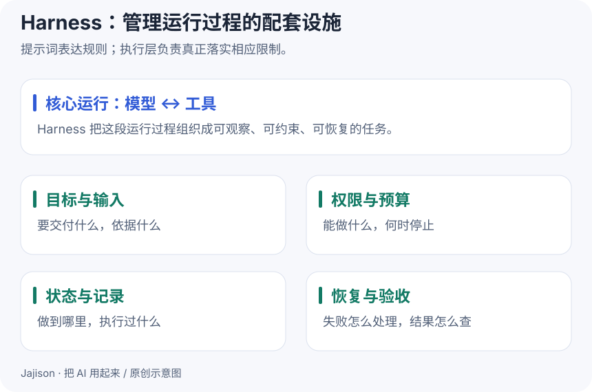

# Harness：给 AI 的运行过程加上边界和记录

**这一课做成什么**：能为一个任务定义权限、预算、状态与验收。

让 AI 连续做事之后，你会遇到新的问题：它读了哪个文件？失败后重试几次？重开会话还能继续吗？什么时候算完成？

本教程把 **Harness** 理解为围绕模型组织的运行配套设施，包括工具执行、状态记录、权限、预算、恢复与验收。这不是某一个固定产品，不同系统覆盖的范围有所不同。

## 用一次工作报告来理解

| 要素 | 在报告任务中怎样落地 |
| --- | --- |
| 目标 | 生成本周工作汇总 |
| 输入边界 | 只读取指定记录 |
| 工具权限 | 允许读取和计算，结果只写 output |
| 预算与停止 | 限定运行时间和重试次数 |
| 状态与记录 | 保存输入标识、执行步骤、结果位置 |
| 验收 | 总数正确；异常记录被报告；源文件不变 |

目标不是让 AI 每一步都征求意见，而是提前定义它能独立完成的范围，以及真正需要人决定的节点。

## 提示要求和硬限制要分清

“不要覆盖文件”写在提示词里，是行为要求；report.py 用排他方式创建文件、遇到重名就拒绝，是程序检查。更强的文件访问隔离还要依赖操作系统、沙箱或工具接口限制。

“最多运行两分钟”同样需要计时与终止机制。模型答应遵守，不等于系统已经实现。不要把提示卡标成完整的权限系统。

## 记忆、状态和日志也不同

- **记忆**：以后仍可能有用的事实或偏好。
- **任务状态**：这个任务目前进行到哪一步。
- **日志**：实际执行过哪些操作、返回了什么。

“正在处理”不是“已验证”。完成后应留下结果文件与验证证据，而不仅是模型的一句总结。

## 给资料助手的一张运行卡

~~~text
目标：回答一个关于练习资料的问题，并标出出处。
范围：只使用 knowledge 目录，不联网，不修改源文件。
步骤：检索 → 检查证据是否足够 → 回答或说明缺信息。
停止：最多检索两轮；仍不足就停止，不补造答案。
交付：结论、来源文件与行号、未解决事项。
验收：每条实质结论都由列出的片段支持。
~~~

项目三会由人手动执行这张卡。它展示了管理方法，但尚未实现自动 Agent 的全套运行环境。

## 动手做

为自己的一个重复任务填写运行卡。找出其中两条“仅写在提示里”的规则，思考由哪个程序或人工步骤真正检查。

**完成标准**：能说明任务何时成功、何时失败、何时停止，以及有哪些证据支持这一判断。

自测：给模型写了十条规则，是否就完成了 Harness？

没有。还要看执行层是否提供相应工具、状态、限制与记录，并实际验证这些机制。说明文字只是其中一部分。

参考：[Anthropic：构建有效 Agent](https://www.anthropic.com/engineering/building-effective-agents)对环境反馈、检查点和停止条件的讨论。本课将这些实践抽象为运行配套设施。

[上一课](18-tools-and-mcp.md) · [下一课：评估效果 →](20-evaluation.md)

